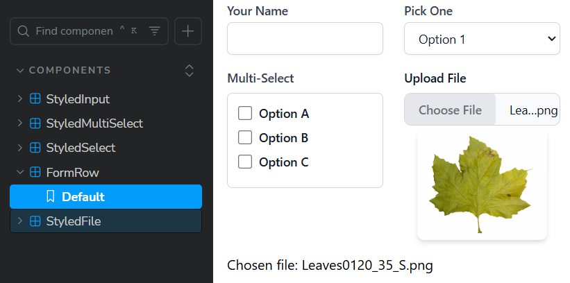
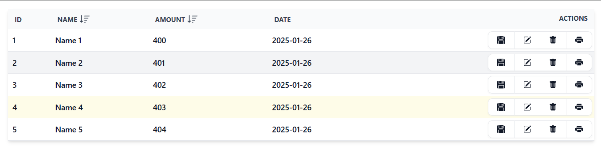

# uic-pack

UI Component Pack for React + Tailwind Projects



## Getting started 🚀

### Install

Install as dependency via your package manager
 - use npm
```bash
# for npm
npm i uic-pack

# for yarn
yarn add uic-pack

# for pnpm
pnpm install uic-pack
```

### Usage

Import working React components from

```javascript
import { StyledInput, FormRow } from "uic-pack";


<FormRow>
  <StyledInput
    type="text" name="name"
    value={name}
    onChange={(e) => setName(e.target.value)}
    label={"Name"}
  />
  <StyledInput
    type="password" name="password"
    value={password}
    onChange={(e) => setPassword(e.target.value)}
    label={"Password"}
  />
</FormRow>
```

#### Importing styles

Add uic-pack css to your global.css file
```css
@import 'uic-pack/dist/uic-pack.css';

@tailwind base;
@tailwind components;
@tailwind utilities;

```


or add uic-pack to your tailwind.config.ts
```typescript
import type { Config } from 'tailwindcss'

const config: Config = {
  content: [
    './src/**/*.{js,ts,jsx,tsx,mdx}',
    './node_modules/uic-pack/dist/uic-pack.js',
  ],
  plugins: [],
}
export default config

```

### Available components

- TableViewComponent 
- FormRow
- StyledFile
- StyledInput
- StyledSelect
- StyledMultiSelect
- DraggableDiv
- MenuBar

## Contribute

 - If you have a feature request, [create an issue](https://github.com/Reterics/uic-pack/issues) or [make a pull request ](https://github.com/Reterics/uic-pack/pulls)
 - If you have a bug to report, [you can create an issue here.](https://github.com/Reterics/uic-pack/issues) Please try to write as much details as possible to help reproduce and fix it.

For more details please read the [CONTRIBUTING.md](./CONTRIBUTING.md) for guidelines and details.

## License

This project is licensed under the [MIT License](./LICENSE).
